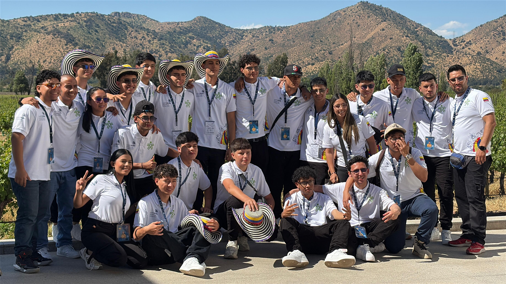
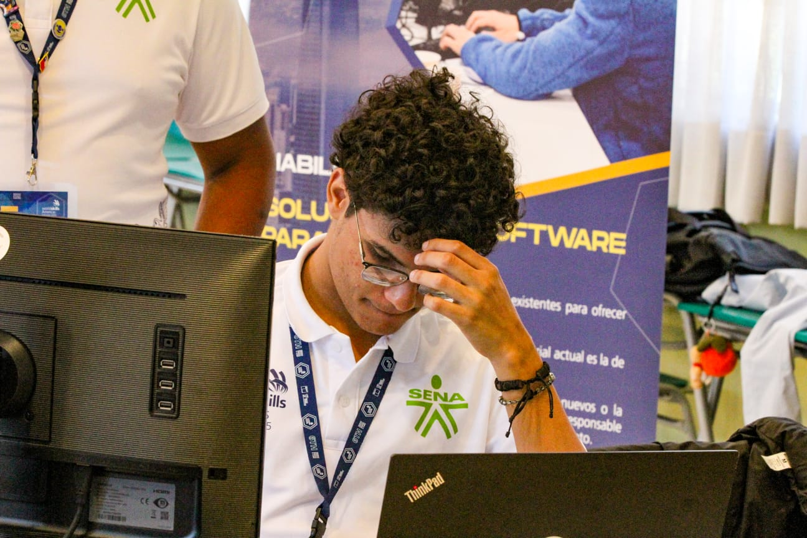
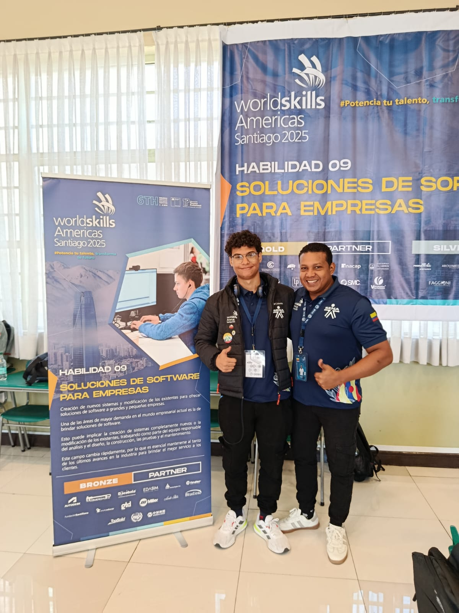
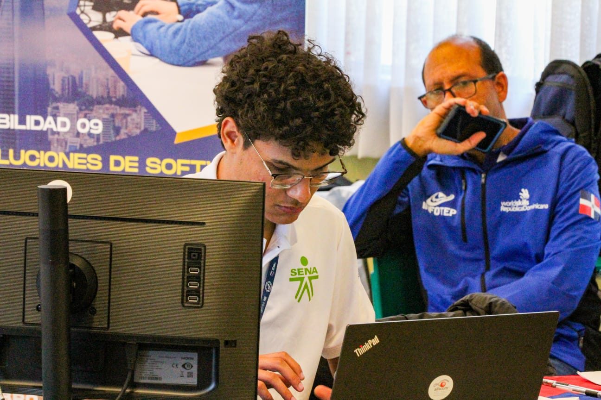

# Worldskills Colombia 2025 **– 🥈 Plata Continental en Desarrollo de Software**

[🥇 Ver anterior competencia (Nacional)](https://github.com/JuanPabloMendozaLopez/worldskills-colombia-2025)

[📰 Noticia SENA](https://www.sena.edu.co/es-co/Noticias/Paginas/noticia.aspx?IdNoticia=8782)

<br>


Este repositorio reúne el trabajo desarrollado durante mi **participación en la competencia internacional WorldSkills Americas 2025**, en la **habilidad 09 – Desarrollo de Software**, donde obtuve **el segundo lugar a nivel continental**.

El evento se llevó a cabo en Santiago de Chile, donde permanecimos una semana completa. Durante tres días de competencia, enfrenté pruebas de alto nivel técnico junto a los mejores competidores de distintos países del continente.

Más allá de los resultados, este repositorio sirve como testimonio del dominio de herramientas y metodologías aplicadas durante las pruebas. Aquí se encuentran los módulos desarrollados bajo la normativa de la competencia, demostrando un compromiso con las mejores prácticas de codificación y la eficiencia en el desarrollo de software de clase mundial.

<br>

<div align="center">


</div>

<br>

## 📚 Tabla de Contenidos

- [🏅 Highlights de la Competencia](#-highlights-de-la-competencia)
- [📁 Estructura del Repositorio](#-estructura-del-repositorio)
- [🎯 Descripcion de la Competencia](#-descripcion-de-la-competencia)
- [📬 Contacto](#-contacto)

<br>

## 🏅 Highlights de la Competencia

<div align="center">

  
  
  _Delegación de Colombia 2025_

  <br>
  
  
  
  _Durante la ejecución de las pruebas técnicas en la competencia nacional_

  <br>
  
  
  
  _Junto a mi experto, Luis Carlos Toncel, pieza clave en la estrategia y el éxito alcanzado en esta competencia continental._

  <br>
  
  
  
  _Ganadores en la habilidad de Desarrollo de Software._

</div>

## 📁 Estructura del Repositorio

```bash
worldskills-colombia-2025/
├── docs/                       # Documentacion e información de la competencia
├── modulo-1/                   # Módulo 1 – 
├── modulo-2/                   # Módulo 2 – 
├── modulo-3/                   # Módulo 3 – 
├── modulo-4/                   # Módulo 4 – 
├── modulo-5/                   # Módulo 5 – 
└── README.md                   # Documentación principal del repositorio
```

<br>

## 🎯 Descripcion de la Competencia  



El desarrollo de los proyectos se realizó bajo condiciones de alta exigencia técnica, utilizando exclusivamente el hardware suministrado por la organización y restringiendo el entorno de software a IDE base como Visual Studio, sin el apoyo de extensiones ni herramientas de autocompletado avanzado. Asimismo, el acceso a internet estuvo limitado a consultas críticas de máximo 5 minutos por módulo, lo que puso a prueba mi capacidad de resolución de problemas, memoria técnica y dominio profundo de los lenguajes de programación en un entorno desconectado.

---

### Primer modulo – Análisis de Datos Comerciales

Integración y normalización de datasets mediante procesos ETL en Power Query para la corrección de inconsistencias, seguido del modelado de datos y la construcción de dashboards interactivos en Excel para el análisis de tendencias comerciales y métricas de rendimiento.

[Ver detalles de la prueba](./modulo-1/README.md)

---

### Segundo modulo – Arquitectura de Software y Diseño de Soluciones

Definición de la arquitectura de software y diseño técnico del sistema de ventas para GSW, que abarca el modelado de requisitos mediante diagramas de casos de uso , el diseño de un modelo de datos relacional normalizado (ERD) , la creación de wireframes de interfaz de usuario con control de acceso por roles y la documentación de una API RESTful para la gestión de entidades.

[Ver detalles de la prueba](./modulo-2/README.md)

---

### Tercer modulo – Desarrollo e Integración de Aplicación de Escritorio y API RESTful

Implementación de una solución full-stack para el sistema de ventas de GSW que integra el desarrollo de una API RESTful en .NET Web API y una aplicación de escritorio de interfaz responsiva. El proyecto comprende la configuración y migración de datos a una base de datos relacional, la exposición de endpoints CRUD con autenticación básica para productos, clientes y pedidos, y la creación de interfaces de usuario para la gestión operativa y el control de estados de pedidos en tiempo real. Finalmente, se incluye una fase de aseguramiento de calidad mediante la documentación de pruebas de aceptación y caja negra para validar la integridad de las operaciones de la API.

[Ver detalles de la prueba](./modulo-3/README.md)

---

### Cuarto modulo – Desarrollo de Aplicación Móvil Orientada al Cliente e Integración de Servicios

Diseño e implementación de una aplicación móvil nativa o híbrida dirigida a los consumidores, centrada en la experiencia de usuario (UX) y la conectividad con sistemas existentes. El proyecto incluye el desarrollo de funcionalidades para la búsqueda avanzada de productos, gestión de pedidos personalizados y seguimiento en tiempo real, junto con la integración de perfiles de usuario que permiten la edición en línea de datos personales, gestión de direcciones y métodos de entrega preferidos.

[Ver detalles de la prueba](./modulo-4/README.md)

---

### Quinto modulo – Implementación de Lógica de Negocio Avanzada, Programas de Fidelización y Gestión de Inventarios

Evolución de la aplicación de escritorio mediante la integración de módulos complejos de inteligencia de negocios y persistencia de datos. El proyecto se enfoca en el desarrollo de un motor de promociones y un sistema de gestión de fidelidad (Loyalty Management) que permite el cálculo automático de puntos, gestión de membresías y canje de recompensas mediante lógica programática.

[Ver detalles de la prueba](./modulo-5/README.md)

<br>

## 📬 Contacto

Para preguntas, soporte o colaboración, por favor contacta:

-   Juan Pablo Mendoza Lopez
-   Correo: [mendozalopez.py@gmail.com](mailto:mendozalopez.py@gmail.com)
-   LinkedIn: [Juan Pablo Mendoza Lopez](https://www.linkedin.com/in/juan-pablo-mendoza-lopez/)
-   GitHub: [@JuanPabloMendozaLopez](https://github.com/JuanPabloMendozaLopez)


